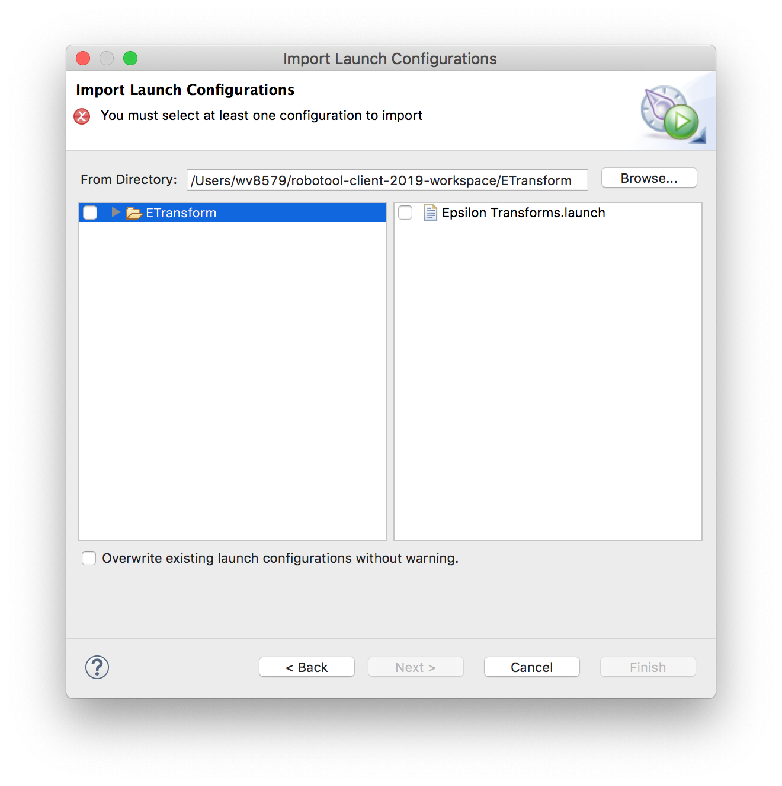

Sample RoboTool project for Epsilon transformations
---------------------------------------------------

Install
=======

Currently this configuration targets the latest version of RoboTool.

1. Installing RoboTool

   Navigating to ``Help > Install New Software``, then typing in the URL ```RoboTool - https://www.cs.york.ac.uk/robostar/robotool/update/``` and selecting all, as shown below.
   
   
   
2. Installing Epsilon
   
   Using the update site: http://download.eclipse.org/epsilon/updates/
   
   Install the following features only, as shown below:
   
	* Epsilon Core
	* Epsilon Core Development Tools
	* Epsilon EMF Integration
	
   

Import
======

1. Importing the project

Import the project, by going to ``File > Import`` and choosing ``General > Projects from folder or archive``. 


Then after clicking on ``Next``, click on ``Archive`` and choose the .zip file. Then choose only the Eclipse project, and not the folder, as shown below. 


Then click on ``Finish``.

Since the imported project is a RoboChart project you will be asked whether you would like to have the graphical representations shown automatically.

2. Importing the launch configuration

Import the launch configuration for the ANT build script by going to ``File > Import`` and choosing ``Run Debug > Launch Configurations``. 


Then locate the directory of the current workspace, expand the tree on the left to reveal the ``Epsilon Transforms.launch`` file, select it and finally click ``Finish``. 



The launch configuration will show under ``Run > External Tools`` as well as by clicking on the green arrow with a suitcase, as shown below.


Run
===

Run > External Tools > Epsilon Transforms.

Configuration
=============

*Source file*

By default only the 'test.rct' file is considered for transformation. This is
parametrised in the External Tools Configuration for "Epsilon Transforms" via
the parameter "SourceFile":

	-DSourceFile="test.rct"
	
There will be better ways in the future of specifying this for all relevant
files in the project, namely, including all necessary packages.

*Launch configuration*

*Target file*

The source file ``test.rct`` is copied to ``test.target.rct``, and afterwards
the EPL transformation renames the RoboChart RCPackage, so that it can be
loaded alongside within RoboTool.

*Epsilon specifications*

These are under the ``erules`` folder.

*Orchestration of transformations*

This is performed by the ``build.xml`` ANT script. Currently only one EPL 
transformation ``erules/transform.epl`` is applied as many times as possible.

*Meta-model of RoboChart*

It is possible to select a different ECore model by changing the parameter
``metamodeluri`` in the 'build.xml' ANT script.
